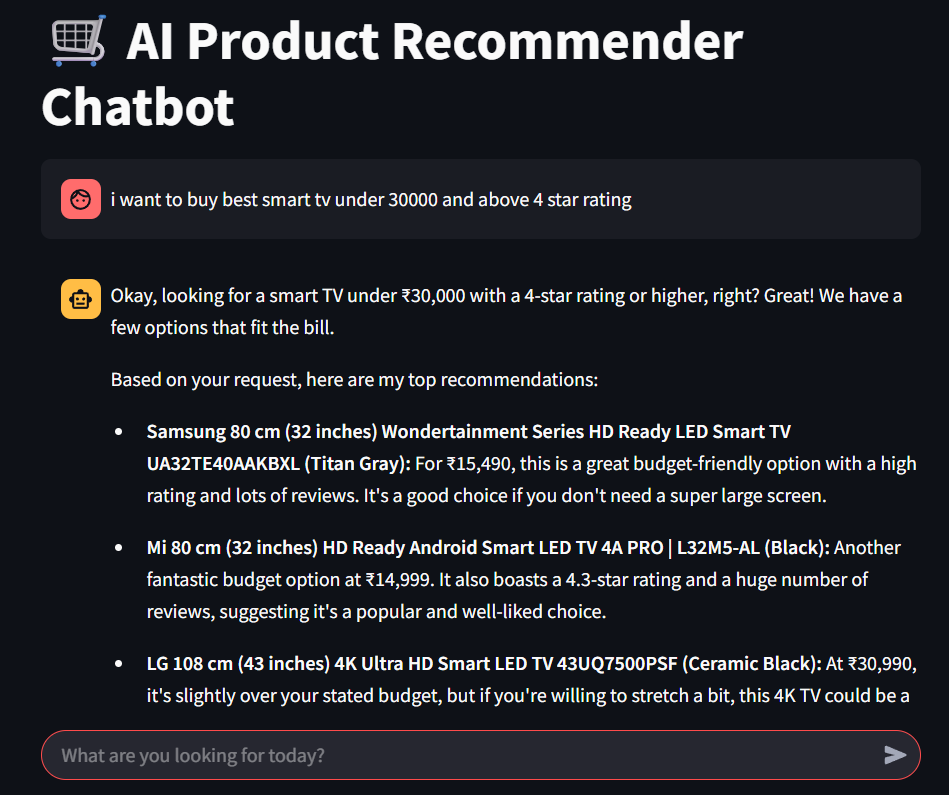
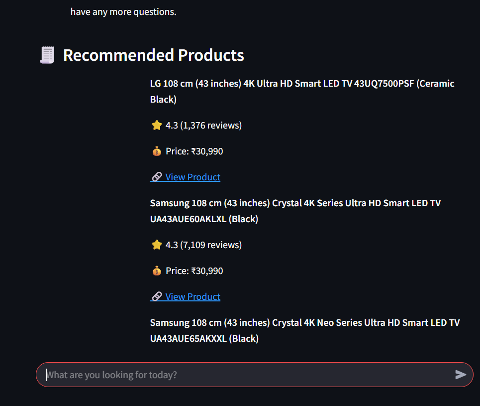
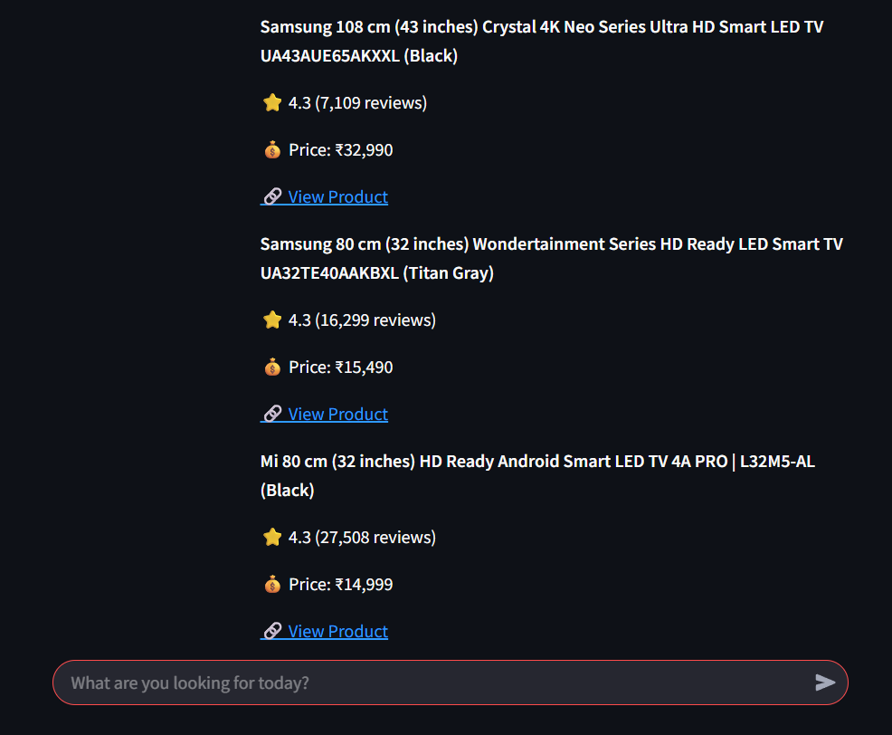

# 🛍️ AI Retail Assistant – Product Recommendation Chatbot

An intelligent product recommendation chatbot built using Retrieval-Augmented Generation (RAG) with Google Gemini and ChromaDB. This assistant understands user queries in natural language and recommends the most relevant Amazon products in real-time via a conversational Streamlit interface.

---

## 🚀 Features

- 💬 Conversational chatbot UI (built with Streamlit)
- 🔎 Natural language query understanding
- 🧠 Google Gemini-powered embedding & generation
- 🗂️ ChromaDB-based semantic product retrieval
- 🛒 Displays product info: name, price, discount, rating, review count, and purchase link
- 🔐 API key secured using `.env` file

---

## 🧠 Tech Stack

- **Python**
- **Streamlit**
- **Google Gemini API (LLM + embeddings)**
- **ChromaDB**
- **Pandas**

---

## 📁 Project Structure

```
├── amazon.csv                  # Amazon product dataset
├── chatbot.py                  # Main Streamlit chatbot UI
├── rag_llm_recommender.py     # RAG-based recommendation logic using Gemini + ChromaDB
├── recommendation_system.ipynb# Development notebook
├── .env                        # Stores API key (not uploaded to GitHub)
├── .gitignore                  # Ignores .env, cache files, etc.
├── chroma_storage/            # Persistent vector DB storage
└── gemini_embeddings.pkl       # Cached embeddings
```

---

## ⚙️ Setup & Run Locally

1. **Clone the repository**
```bash
git clone https://github.com/Payal-singlaa/RAG-LLM-based-product-recommendation-chatbot.git
cd RAG-LLM-based-product-recommendation-chatbot
```

2. **Install dependencies**
```bash
pip install -r requirements.txt
```

3. **Create `.env` file**
```env
GOOGLE_API_KEY=your_actual_gemini_api_key
```

4. **Run the chatbot**
```bash
streamlit run chatbot.py
```

---

## 📸 Demo Preview

<p align="center">
  
  
</p>

<p align="center">
  
  
</p>


---

## ✅ To-Do / Future Improvements

- Add voice input/output
- Show product cards with images
- Add user-specific recommendations based on past queries
- Deploy on Streamlit Cloud

---

## 🧑‍💻 Author

**Payal Singla**  
[GitHub](https://github.com/Payal-singlaa) | [LinkedIn](www.linkedin.com/in/payal-singla-287880257)
